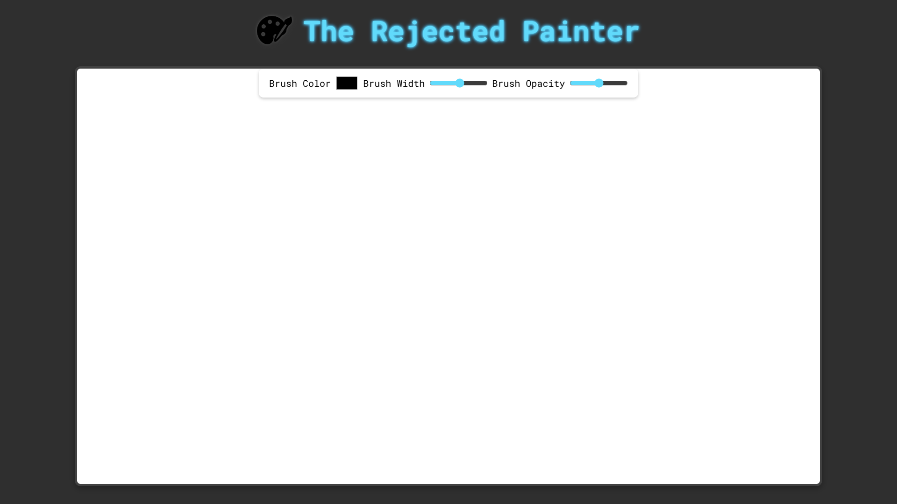

# 🎨 Rejected Painter

**Rejected Painter** is a sleek and fun drawing app with beautifully styled CSS for a smooth, visually pleasing experience.  
Users can paint with adjustable **brush sizes**, **colors**, and **opacity** to create vibrant, unique artwork.

---

## ✨ Features

- 🖌 **Adjustable Brush Size** – Fine-tune your strokes for detail or bold lines.
- 🎨 **Custom Colors** – Pick any color for your brush.
- 🌫 **Brush Opacity Control** – Create soft, transparent strokes or solid fills.
- 💎 **Clean & Stylish Interface** – Elegant CSS design for a smooth experience.
- ⚡ **Lightweight & Fast** – Runs instantly in your browser.

---

## 🛠 Tech Stack

- **HTML5 Canvas API** – For drawing functionality.
- **CSS3** – For modern, polished styling.
- **JavaScript (Vanilla)** – For interactive painting logic.

---

## 📷 Screenshots

